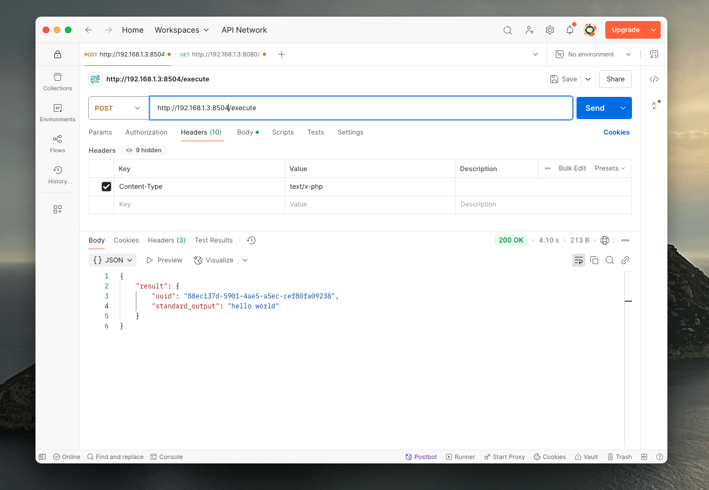
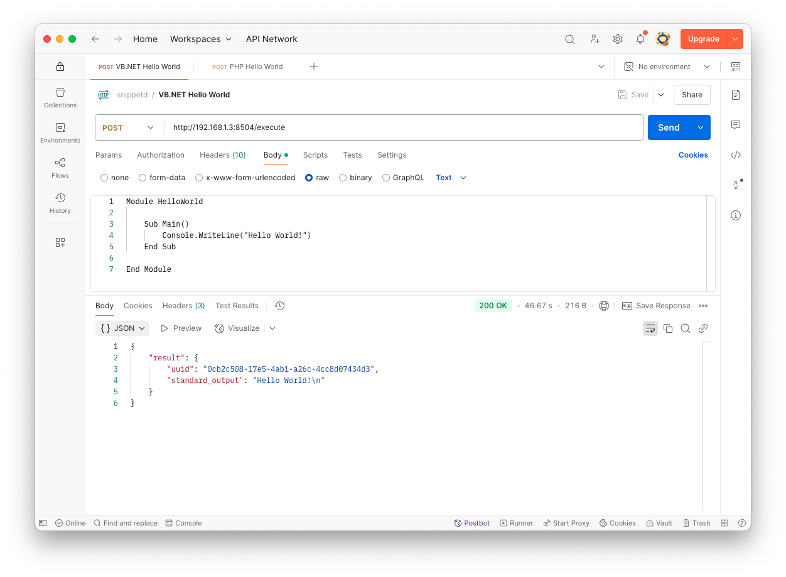

# snippetd

> [!WARNING]  
> This is an application that can execute arbitrary code without authentication. It is published for research and development purposes. Do not use this application if you do not understand its nature.

`snippetd` or _/ˈsnɪpədi/_ is a Linux daemon serving an API that allows executing, interpreting or compiling **code snippets** from various programming languages using containerd and containers from the docker hub.



## Usage

The API is very simple as it only provides a basic banner in the root `/`, a list of all supported programming language runtimes under `/runtimes` and the execution of code under `/execute`.

```bash
curl -X POST \
    -H "Content-Type: text/x-php" \
    -d "<?php echo 'hello world';" \
    http://192.168.1.3:8504/execute
```

When posting a source code to the endpoint, it will check if the `Content-Type` _(MIME Type)_ is supported. If the language is supported, it'll create a temporary folder on the host, a container for the language with the temporary folder that includes the default source file name and the execution shell script. The shell scripts can be found in the [config/runtime](config/runtime). 



The more complex runtimes like C, C++, C# and VB.NET will create the necessary project structure (i.e. .NET) and compile the source code before executing it.

### Supported languages

The following programming languages are currently supported with the respective MIME types and containers.

| Language     | MIME Types                                                                                                                  | Container                                         |
|--------------|-----------------------------------------------------------------------------------------------------------------------------|---------------------------------------------------|
| Bash         | `application/x-sh`<br />`application/x-bash`<br />`text/x-sh`<br />`text/x-shellscript`                                     | `docker.io/library/debian:latest`                 |
| PHP          | `application/x-httpd-php`<br />`application/x-php`<br />`text/x-php`                                                        | `docker.io/library/php:latest`                    |
| Python       | `application/x-python-code`<br />`application/x-python`,<br />`text/x-python`                                               | `docker.io/library/python:latest`                 |
| Ruby         | `application/x-ruby`<br />`text/x-ruby`                                                                                     | `docker.io/library/ruby:latest`                   |
| JavaScript   | `application/javascript`<br />`text/javascript`<br />`application/x-javascript`                                             | `docker.io/library/node:latest`                   |
| Go           | `application/x-go`<br />`text/x-go`<br />`text/x-go-source`                                                                 | `docker.io/library/golang:latest`                 |
| C            | `text/x-c`<br />`text/x-c-header`<br />`application/x-c`<br />`application/x-c-header`                                      | `docker.io/library/gcc:latest`                    |
| C++          | `text/x-c++`<br />`text/x-c++-header`<br />`application/x-c++`<br />`application/x-c++-header`                              | `docker.io/library/gcc:latest`                    |
| C#           | `application/x-csharp`<br />`text/x-csharp`<br />`text/x-csharp-source`                                                     | `mcr.microsoft.com/dotnet/sdk:latest`             |
| VB.NET       | `text/x-vb`<br />`application/x-vb`                                                                                         | `mcr.microsoft.com/dotnet/sdk:latest`             |
| Java         | `text/x-java-source`<br />`text/x-java`<br /> `application/x-java-source`<br />`application/x-java`<br />`application/java` | `docker.io/library/openjdk:latest`                |
| Rust         | `text/x-rust`                                                                                                               | `docker.io/library/rust:latest`                   |
| Swift        | `text/x-swift`                                                                                                              | `docker.io/library/swift:latest`                  |
| TypeScript   | `application/typescript`<br />`text/typescript`                                                                             | `mcr.microsoft.com/devcontainers/typescript-node` |

## Installation

`snippetd` comes with the `install.sh` script for Linux that will install the systemd service with the `snippetd.service` file, create the `snippetd` user and the `containerd` group, change group ownership and permissions of the containerd socket. Afterwards it'll start the systemd service.

> [!WARNING]  
> Make sure you are 100% aware of what this application does and how the install script works. Check the script before executing it! **Snippetd has no authentication, do not run it in public!**

```bash
./install.sh
```

## Security

There are security considerations for this application as it allows executing containers and arbitrary code. It is important that you understand the impact of this application, the lack of authentication and security. This aims to serve as a sandboxed sidecar for any application that wishes to execute arbitrary code on Linux.

## Testing

These are some sample source codes to test if `snippetd` is working correctly.

### Visual Basic .NET

The sample application in `VB.NET` _(Visual Basic .NET)_ is a good test case, because Visual Basic does not have curly braces, .NET is complicated to setup and picky with its environment. Further it queries a weather API and thus uses networking with HTTP. It's a good example to test if the setup works. If `VB.NET` works, you can be sure the other languages work as well.

```vbnet
Imports System
Imports System.Net.Http
Imports System.Text.Json
Imports System.Text.Json.Nodes ' Import JsonNode
Imports System.Threading.Tasks

Module WeatherFetcher

    Sub Main()
        GetWeatherAsync().Wait()
    End Sub

    Async Function GetWeatherAsync() As Task
        Dim latitude As String = "47.6786"
        Dim longitude As String = "-122.1310"
        Dim apiUrl As String = $"https://api.open-meteo.com/v1/forecast?latitude={latitude}&longitude={longitude}&current_weather=true"

        Console.WriteLine($"Fetching current temperature for Redmond, WA...")

        Using client As New HttpClient()
            Try
                Dim response As HttpResponseMessage = Await client.GetAsync(apiUrl)
                response.EnsureSuccessStatusCode()

                Dim responseContent As String = Await response.Content.ReadAsStringAsync()
                ' Parse the JSON response
                ParseWeatherJson(responseContent)

            Catch ex As HttpRequestException
                Console.WriteLine($"Error fetching weather data: {ex.Message}")
            Catch ex As Exception
                Console.WriteLine($"An unexpected error occurred: {ex.Message}")
            End Try
        End Using
    End Function

    Sub ParseWeatherJson(jsonString As String)
        Try
            Using jsonDocument As JsonDocument = JsonDocument.Parse(jsonString)
                Dim root As JsonNode = jsonDocument.RootElement.Deserialize(Of JsonNode)() ' Deserialize to JsonNode

                If root IsNot Nothing AndAlso root("current_weather") IsNot Nothing Then
                    Dim currentWeatherElement As JsonNode = root("current_weather")

                    If currentWeatherElement("temperature") IsNot Nothing Then
                        Dim temperatureCelsius As Double = currentWeatherElement("temperature").GetValue(Of Double)
                        Dim temperatureFahrenheit As Double = (temperatureCelsius * 9 / 5) + 32

                        Console.WriteLine($"Current Temperature in Redmond, WA:")
                        Console.WriteLine($"  Celsius: {temperatureCelsius}°C")
                        Console.WriteLine($"  Fahrenheit: {Math.Round(temperatureFahrenheit, 2)}°F")
                    Else
                        Console.WriteLine("Temperature data not found in the response.")
                    End If
                Else
                    Console.WriteLine("Current weather data not found in the response.")
                End If
            End Using

        Catch ex As JsonException
            Console.WriteLine($"Error parsing JSON: {ex.Message}")
            Console.WriteLine($"Raw JSON response: {jsonString}")
        Catch ex As Exception
            Console.WriteLine($"An unexpected error occurred during JSON processing: {ex.Message}")
            Console.WriteLine($"Raw JSON response: {jsonString}")
        End Try
    End Sub

End Module
```