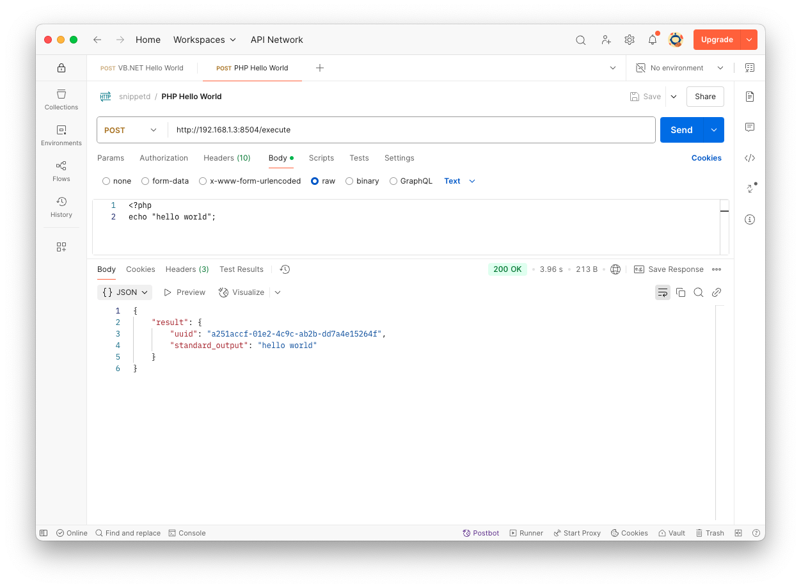

# snippetd

`snippetd` (_pronounced as /ˈsnɪpədi/_) is a Linux daemon serving an API that allows executing, interpreting or compiling **code snippets** from various programming languages using containerd and containers from the docker hub.



## Usage

The API is very simple as it only provides a basic banner in the root `/`, a list of all supported programming language runtimes under `/runtimes` and the execution of code under `/execute`.

```bash
curl -X POST \
    -H "Content-Type: text/x-php" \
    -d "<?php echo 'hello world';" \
    http://192.168.1.3:8504/execute
```

When posting a source code to the endpoint, it will check if the `Content-Type` _(MIME Type)_ is supported. If the language is supported, it'll create a temporary folder on the host, a container for the language with the temporary folder that includes the default source file name and the execution shell script. The shell scripts can be found in the [config/runtime](config/runtime). 

### Supported languages

The following programming languages are currently supported with the respective MIME types and containers.

| Language     | MIME Types                                                                                                                  | Container                                        |
|--------------|-----------------------------------------------------------------------------------------------------------------------------|--------------------------------------------------|
| Bash         | `application/x-sh`<br />`application/x-bash`<br />`text/x-sh`<br />`text/x-shellscript`                                     | `debian:latest`                                  |
| PHP          | `application/x-httpd-php`<br />`application/x-php`<br />`text/x-php`                                                        | `php:latest`                                     |
| Python       | `application/x-python-code`<br />`application/x-python`,<br />`text/x-python`                                               | `python:latest`                                  |
| Ruby         | `application/x-ruby`<br />`text/x-ruby`                                                                                     | `ruby:latest`                                    |
| JavaScript   | `application/javascript`<br />`text/javascript`<br />`application/x-javascript`                                             | `node:latest`                                    |
| Go           | `application/x-go`<br />`text/x-go`<br />`text/x-go-source`                                                                 | `golang:latest`                                  |
| C            | `text/x-c`<br />`text/x-c-header`<br />`application/x-c`<br />`application/x-c-header`                                      | `gcc:latest`                                     |
| C++          | `text/x-c++`<br />`text/x-c++-header`<br />`application/x-c++`<br />`application/x-c++-header`                              | `gcc:latest`                                     |
| C#           | `application/x-csharp`<br />`text/x-csharp`<br />`text/x-csharp-source`                                                     | `mcr.microsoft.com/dotnet/sdk:latest`            |
| VB.NET       | `text/x-vb`<br />`application/x-vb`                                                                                         | `mcr.microsoft.com/dotnet/sdk:latest`            |
| Java         | `text/x-java-source`<br />`text/x-java`<br /> `application/x-java-source`<br />`application/x-java`<br />`application/java` | `openjdk:latest`                                 |
| Rust         | `text/x-rust`                                                                                                               | `rust:latest`                                    |
| Swift        | `text/x-swift`                                                                                                              | `swift:latest`                                   |
| TypeScript   | `application/typescript`<br />`text/typescript`                                                                             | `mcr.microsoft.com/devcontainers/typescript-node` |